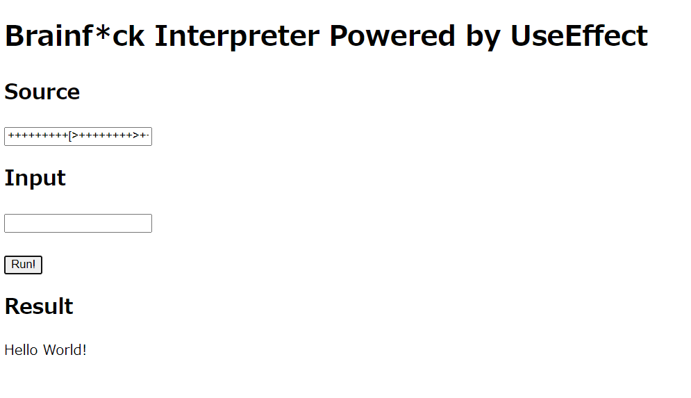

# useeffect-brainf_ck
inplement Brainf*ck interpreter using React `useEffect` function

# usage

1. Exec below

```bash
$ yarn
$ yarn dev
```

2. Access to http://localhost:5173/

3. Run codes whatever you want to!



# features

- Brainf*ck implementation consists of 100% pure function
- Interpreter is driven by self-modification of the state inside `useEffect()`
